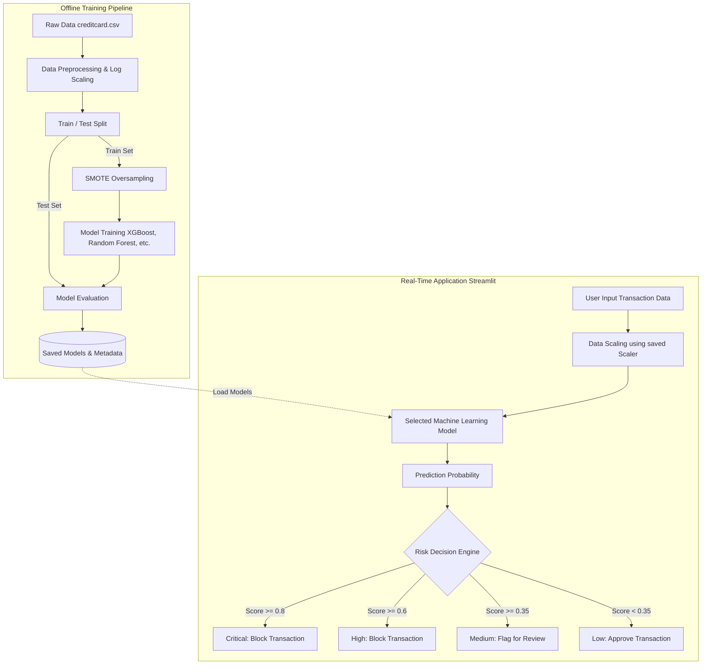

# Credit Card Fraud Detection - System Design

This document provides an easy-to-understand breakdown of how the Credit Card Fraud Detection project is structured, how data flows through it, and how decisions are made.

## 1. High-Level Architecture

The system is split into two distinct parts:
1. **The Offline Training Pipeline**: A set of scripts that digest historical data, balance extreme class imbalances, and train various AI models.
2. **The Real-Time Application (Streamlit)**: An interactive dashboard that loads the pre-trained models and allows users to input new transactions to instantly receive a risk assessment.

---

## 2. Component Breakdown

### A. The Data Pipeline (`pipeline/`)
The data pipeline is responsible for teaching the models how to catch fraud. Because fraud only happens in ~0.17% of transactions, standard models will just guess "Legitimate" every time. We fix this using the pipeline.

- **`01_eda.py` (Exploratory Data Analysis)**: Scans the raw data to figure out class distributions and important statistics.
- **`02_preprocessing.py`**: Takes the highly variable `Amount` column and applies a "Log Scaler" to compress the values. It then splits the data so we have a pure "Test" set to evaluate our models on later.
- **`03_train.py`**: The brain of the operation. It applies **SMOTE** (Synthetic Minority Over-sampling Technique) to artificially generate more examples of fraud *only in the training set*. Then, it trains four distinct models:
  - **XGBoost + SMOTE**: A powerful supervised tree-based model (the default choice).
  - **Random Forest + SMOTE**: An ensemble of decision trees.
  - **Isolation Forest**: An unsupervised model that looks for "anomalies" or outliers.
  - **One-Class SVM**: Another unsupervised model that learns the boundary of "normal" behavior.
- **`04_evaluate.py`**: Tests the trained models against the unseen Test set. Because traditional "Accuracy" is misleading here, this script calculates the **F1-Score**, **Precision**, and **Recall**. It also finds the optimal decision "Threshold" to balance catching fraud versus accidentally flagging legitimate users.

### B. The Application Layer (`app.py`)
This is the user-facing Streamlit dashboard that puts the trained models to work.

- **Caching & Loading**: Upon startup, the app loads the trained models (`.pkl` files) and the ideal threshold values from the `models/` directory.
- **Live Transaction Simulator**: Users can randomly pull historical transactions or manually adjust sliders to create hypothetical transactions (e.g., setting transaction amount, feature V10, V14, etc.).
- **Risk Decision Engine**: Once the model calculates the probability of fraud, it goes through a Risk Tier system:
  - **Critical (80%+ probability)**: Transaction is blocked immediately.
  - **High (60%+ probability)**: Transaction is blocked.
  - **Medium (35%+ probability)**: Transaction is approved but flagged for manual human review.
  - **Low (< 35% probability)**: Transaction goes through smoothly.
- **Explainability**: The dashboard features an impact estimator (calculating financial net savings based on caught fraud vs. friction costs of false alarms) and breaks down *which* features contributed the most to the model's decision.

---

## 3. Deployment Architecture (Hugging Face Spaces)

The application is containerized using Docker (or directly via Streamlit SDK) and is deployed on **Hugging Face Spaces**. 

1. **GitHub Repository**: Acts as the single source of truth for the codebase.
2. **GitHub Actions**: Whenever new code is pushed to the `main` branch, a CI/CD pipeline (`sync_to_hub.yml`) is triggered.
3. **Hugging Face Hub**: The action securely authenticates with Hugging Face and pushes the code. Hugging Face then automatically rebuilds the Streamlit container and makes the dashboard live on the web.
