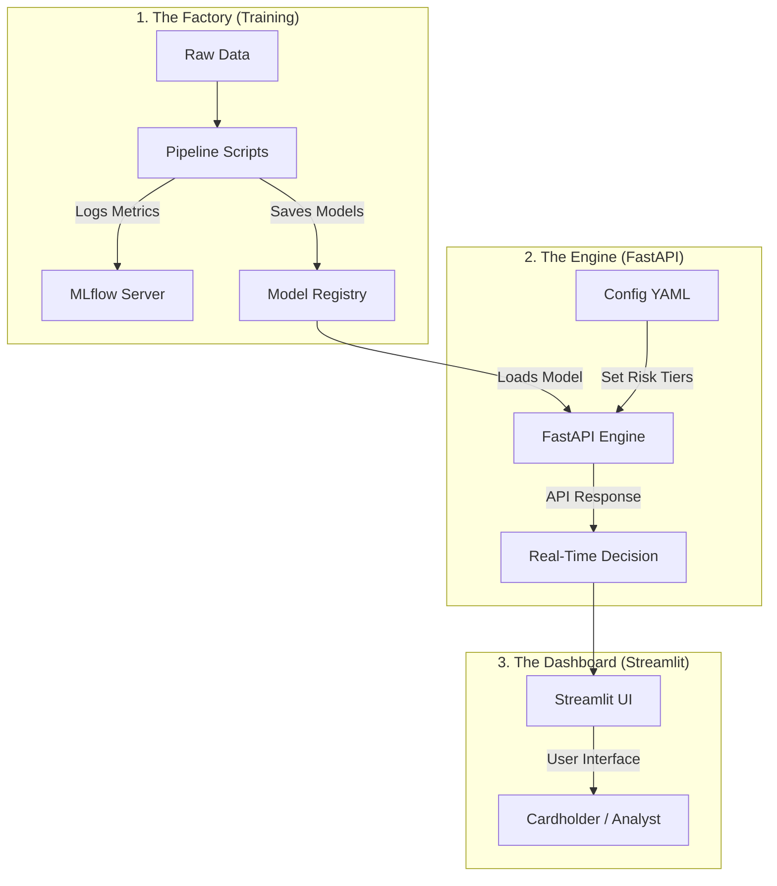

# Credit Card Fraud Detection - System Design
> A high-level overview of our professional MLOps architecture.

This document explains how the project is structured, how data flows, and how the "brain" of the system (the AI models) is managed and served.

---

## 1. Simple Architecture Diagram

Our system works in three distinct stages: **Training**, **Serving**, and **Visualization**.

---

## 2. Component Breakdown

### A. The MLOps Pipeline (`pipeline/`)
Instead of one messy script, the project is split into modular components. 
- **`preprocessing.py`**: Cleans data and prepares features.
- **`train.py`**: Trains the models. It is integrated with **MLflow** to track every experiment (accuracy, precision, etc.) so we never lose a good model.
- **`evaluate.py`**: Automatically tests the model to ensure it meets our quality standards.

### B. The Production Engine (`api.py`)
This is the "brain" of the project. We use **FastAPI** to create a high-speed prediction service.
- **Validation**: It uses Pydantic to ensure that every incoming transaction request has the correct format.
- **Risk Decision Engine**: It doesn't just give a percentage; it maps that percentage to professional Risk Tiers (Critical, High, Medium, Low) based on the business rules.

### C. The Central Brain (`configs/config.yaml`)
Everything is controlled from one file. If you want to change the "Risk Threshold" (how aggressive the fraud detection is), you just change a number in this YAML file. **No code changes needed!**

### D. The User Dashboard (`app.py`)
This is the "Face" of the project. It's a **Streamlit** dashboard used by human analysts to:
- See charts of fraud patterns.
- Test specific transactions to see how the model reacts.
- View the "Net Savings" estimator to see the financial impact of the model.

---

## 3. Deployment Flow (CI/CD)

The project is built to be "Always Ready."
1. **GitHub**: The code is stored and versioned here.
2. **GitHub Actions**: Every time we update the code, an automated workflow (`sync_to_hub.yml`) pushes the project to Hugging Face.
3. **Hugging Face Spaces**: The final application is hosted here, making it accessible from anywhere in the world.

---

## 4. Why this is "Senior Level" Design?
- **Decoupled:** The API is separate from the UI.
- **Tracked:** Every training run is saved in MLflow.
- **Validated:** Automated tests (`pytest`) verify every part of the system.
- **Configurable:** Business logic is stored in YAML, not hardcoded.
