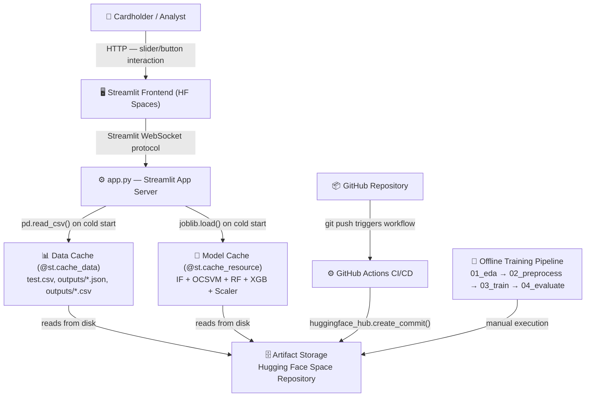

# hld.md — High Level System Design (Google-Grade)
> Credit Card Fraud Detection | Real-Time Risk Scoring System

---

## Section 1 — System Classification

- **Inference type:** Hybrid — Batch (offline training pipeline) + Real-time (Streamlit inference on demand)
- **Online learning:** No — models are trained offline and served statically
- **Use-case category:** Tabular binary classification, anomaly detection, financial risk scoring
- **Latency requirement:** Sub-200ms for real-time transaction scoring (card payment networks require <100ms)
- **Scale (current):** Single-user Streamlit demo on Hugging Face free tier

---

## Section 2 — Architecture Diagram



**Arrow annotations:**
- User → Browser: HTTP/WebSocket, <10ms, failure: 503 if HF Space down
- AppServer → ModelCache: joblib deserialization, ~3s cold start (33MB RF pkl), failure: OOM if models exceed HF container RAM
- CI → Artifacts: HTTPS API call, ~30s, failure: auth token expiry

---

## Section 3 — Component Design

### 1. Data Ingestion Layer
- **Responsibility:** Load raw `creditcard.csv` and pass to preprocessing scripts
- **Tech:** Python + pandas `read_csv()`
- **Input:** `data/raw/creditcard.csv` (284,807 rows × 31 cols)
- **Output:** DataFrame in memory
- **Failure mode:** FileNotFoundError (partially handled in `01_eda.py`). No retry, no schema validation.
- **Mitigation needed:** Pandera/Great Expectations schema check; checksums for data integrity

### 2. Feature Store / Preprocessing Service
- **Responsibility:** Transform raw features → model-ready features; persist train/test splits and scaler
- **Tech:** `02_preprocessing.py` using pandas + sklearn StandardScaler + joblib
- **Input:** Raw DataFrame
- **Output:** `train.csv`, `test.csv`, `feature_ranges.json`, `log_amount_scaler.pkl`
- **Failure mode:** Silent drift if upstream Amount distribution changes (scaler mean/std invalidated)
- **Mitigation:** PSI check on Amount distribution at each retraining run

### 3. Model Serving Layer
- **Responsibility:** Load serialized models and produce fraud probability scores on demand
- **Tech:** joblib-loaded sklearn/xgboost models in Streamlit with `@st.cache_resource`
- **Input:** Feature vector (29 dimensions) as pandas DataFrame row
- **Output:** fraud_probability ∈ [0,1], risk_tier, decision_action
- **Failure mode:** Cache miss on every Streamlit cold start (3–5s delay). OOM if all 4 models exceed RAM.
- **Mitigation:** Load only selected model by default; lazy-load others on demand

### 4. API Gateway
- **Responsibility:** Route user input to model, return predictions
- **Current state:** ❗ NOT IMPLEMENTED — Streamlit handles UI + inference in single process
- **Proposed:** FastAPI with `POST /predict` endpoint, Pydantic validation, rate limiting
- **Tech (proposed):** FastAPI + uvicorn + Pydantic v2
- **Input contract:** `{"amount": float, "v_features": {"V14": float, ...}}`
- **Output contract:** `{"fraud_probability": float, "risk_tier": str, "action": str, "model": str, "latency_ms": int}`

### 5. Cache Layer
- **Responsibility:** Avoid repeated model loading and data file I/O
- **Current:** `@st.cache_resource` (process-level, single instance), `@st.cache_data` (data-level)
- **Production:** Redis with TTL — cache transaction hash → prediction for duplicate requests
- **Failure mode:** Cache invalidation on model update; stale predictions served

### 6. Storage (raw data / features / model artifacts)
- **Responsibility:** Persist all pipeline artifacts
- **Current:** Hugging Face Space repository (Git-based LFS for large files)
- **Artifacts:** `models/*.pkl` (total ~36MB), `data/processed/*.csv` (total ~305MB), `outputs/*.png` + `*.json`
- **Production:** AWS S3 / GCS with versioned paths: `s3://bucket/models/v1.2.3/xgboost_fraud.pkl`
- **Failure mode:** HF Git LFS bandwidth limits on free tier for large CSV files

### 7. Monitoring Service
- **Responsibility:** Track model performance, feature drift, business KPIs in production
- **Current:** ❗ NOT IMPLEMENTED
- **Production design:**
  - Prometheus metrics: inference latency (p50/p95/p99), request volume, error rate
  - Feature drift: PSI (Population Stability Index) on V14, V10, V12, log_Amount daily
  - Model drift: rolling 7-day precision/recall vs baseline
  - Alert: PagerDuty/Slack if Recall drops >5% week-over-week
  - Dashboard: Grafana with fraud rate, false positive rate, avg transaction amount flagged

### 8. Retraining Trigger
- **Responsibility:** Detect model degradation and trigger pipeline re-execution
- **Current:** ❗ NOT IMPLEMENTED — manual execution only
- **Production design:**
  - PSI > 0.2 on key features → trigger retraining
  - Weekly scheduled retraining on rolling 6-month window
  - Champion/Challenger A/B test before promoting new model
  - MLflow Model Registry for versioned promotion workflow

---

## Section 4 — Data Flow (Step-by-Step)

```
Step 1: creditcard.csv loaded from disk → DataFrame (284,807 × 31) | ~0.5s | Latency: negligible
Step 2: EDA script computes class distribution, feature correlations → 6 PNG plots + eda_summary.json | ~15s
Step 3: Preprocessing: log1p(Amount), drop Amount+Time, stratified split → train.csv (227,845×29) + test.csv (56,962×29) | ~3s
Step 4: StandardScaler fit on train log_Amount → transform train + test | ~0.1s | scaler saved to pkl
Step 5: Training — 4 parallel tracks (wall time varies: IF ~30s, OCSVM ~120s on 50K, RF ~180s, XGB+CV ~300s)
Step 6: Models serialized via joblib → models/*.pkl (total ~36MB) | ~5s
Step 7: Evaluation script loads all 4 models, scores test set → model_comparison_table.csv, PR curves, confusion matrix | ~60s
Step 8: On Streamlit startup: load_data() reads test.csv + all JSON/CSV outputs (~0.5s, cached)
Step 9: On Streamlit startup: load_models() deserializes all 4 pkl files (~3–5s, cached after first load)
Step 10: User interaction → input_vector built from sliders → scaled log_Amount → model.predict_proba() → result | <50ms
Step 11: GitHub push → GitHub Actions → huggingface_hub.create_commit() → HF Space rebuild (~30s CI + ~60s HF rebuild)
```

**Total latency budget for inference (Step 10):** <50ms for RF/XGB predict_proba on single row

---

## Section 5 — Scalability Plan

| Scale | Architecture Change |
|---|---|
| 1K users | Current Streamlit on HF free tier handles this (single-threaded, but low concurrency expected) |
| 10K users | Add persistent process with gunicorn/uvicorn. Separate model serving from UI. Move to HF Pro or AWS EC2 t3.medium. |
| 100K users | FastAPI + async inference. Load balancer (nginx/ALB). Multiple replicas. Redis for response caching. |
| 1M users | Kubernetes (EKS/GKE) with horizontal pod autoscaling. Separate ML service from API gateway. ONNX export for XGBoost (3–10× faster inference). Kafka for streaming transaction events. |
| 10M users | Multi-region deployment. Feature store (Feast/Tecton) for sub-millisecond feature serving. Model compiled to TensorRT or ONNX Runtime. Kafka Streams for real-time feature computation (velocity, device fingerprint). Tiered caching (L1: in-process, L2: Redis, L3: DynamoDB). |

**Horizontal vs vertical scaling:**
- Model serving: horizontal (stateless — each replica loads same pkl)
- Database (transaction history): vertical first, then sharding by user_id or card_hash
- Feature computation: horizontal (Kafka partitions by card_number)

**Caching strategy:**
- Transaction hash → prediction: Redis with 5-minute TTL (same card may retry declined transaction)
- Model artifacts: loaded once at container startup, held in RAM
- Feature statistics (mean/std for monitoring): precomputed daily, cached in Redis

---

## Section 6 — Performance Optimization

**Latency targets (production fraud detection):**
- P50: <20ms
- P95: <50ms
- P99: <100ms (card network requirement)
- Current Streamlit demo: ~50ms (single row, cached model, no API overhead)

**Model optimization techniques:**
1. **ONNX export:** Convert XGBoost → ONNX → 3–5× inference speedup via ONNX Runtime
2. **Quantization:** XGBoost supports INT8 quantization — reduces model size 4× with <1% accuracy loss
3. **Model distillation:** Train lightweight neural network (2-layer MLP) to match XGBoost probabilities
4. **Feature precomputation:** Precompute V1–V28 PCA components for known cards during off-peak

**Batching strategy:**
- Current: single-row inference only
- Production: dynamic batching (wait up to 5ms, batch up to 64 transactions) → GPU-friendly for neural models

**Precomputation vs runtime:**
- Precompute: feature ranges, scaler parameters, model artifacts
- Runtime: PCA projection (must be real-time), threshold application, risk tier mapping

---

## Section 7 — Reliability & Fault Tolerance

| Failure Scenario | Detection | Recovery | User Impact |
|---|---|---|---|
| Model inference failure (pkl corrupt) | Exception in predict_proba() | Fallback to simpler model (IF) or rule-based flag if amount > €500 | Degraded accuracy, not outage |
| HF Space container OOM | Streamlit crash / 502 error | Restart container; lazy-load models | App unavailable for ~60s |
| Slow inference (>200ms) | Prometheus latency alert | Auto-scale replicas; enable batching | Increased response time |
| Data pipeline failure | FileNotFoundError in EDA script | Alert on-call; serve stale model artifacts | No new training; model ages |
| Model drift (silent degradation) | PSI > 0.2 weekly batch check | Trigger retraining pipeline | Undetected fraud increase |
| GitHub Actions CI failure | Workflow failure notification | Manual rollback via HF UI | Code not synced to HF Space |
| Scaler mismatch (new data distribution) | Spike in model_output distribution PSI | Retrain scaler + models | Silent accuracy degradation |

---

## Section 8 — Cost Optimization Analysis

| Component | Current Cost Driver | Optimization Strategy |
|---|---|---|
| Compute | HF Spaces free CPU tier (2 vCPU, 16GB RAM) | For production: spot instances for training (80% cheaper); reserved instances for serving |
| Storage | HF Git LFS (305MB data CSVs) | Store large CSVs in S3/GCS; keep only model artifacts in HF repo |
| Network | None currently (all local files) | CDN for static assets (plots); compress JSON outputs with gzip |
| Model serving | Single-instance Streamlit | Containerize + run on AWS Lambda (pay-per-request for low traffic); ECS Fargate for sustained load |
| Training | Local machine (free) | AWS SageMaker Spot Training for retraining runs; ~$0.10/hour for t3.xlarge spot |

---

## Section 9 — Observability Stack

**Metrics to track:**
```
inference_latency_ms{model="xgboost", p50, p95, p99}
request_count_total{endpoint="/predict", status="200|400|500"}
fraud_probability_distribution{bucket="0-0.1|0.1-0.3|0.3-0.5|0.5-1.0"}
feature_psi{feature="V14|V10|log_Amount"} — daily vs training baseline
fraud_detection_rate_7d — rolling 7-day recall (requires feedback loop)
false_positive_rate_7d — requires confirmed-legitimate feedback
model_version{active="xgboost_v1.2.3"}
```

**Alerting thresholds:**
- Page on-call: inference latency P99 > 200ms for 5 min | error rate > 1% | PSI > 0.25 on V14
- Auto-rollback: fraud_probability distribution mean shifts > 2σ from baseline
- Weekly report: precision/recall comparison vs previous week

**Production ML Dashboard (Grafana panels):**
1. Real-time fraud alert rate (transactions/hour flagged)
2. P50/P95/P99 inference latency time-series
3. Feature distribution comparison: current week vs training baseline
4. Model confidence score distribution (should remain stable)
5. Business KPI: estimated EUR saved (TP × avg_fraud_amount)
6. False positive rate trend (critical for customer experience)

---

## Section 10 — System Design Interview Questions

1. **"How would you serve this model to handle 1M transactions/day with P99 < 100ms?"**
   → Direction: FastAPI + ONNX Runtime + horizontal autoscaling + Redis caching + async batching

2. **"The fraud team says your model started missing fraud last week. How do you debug this?"**
   → Direction: Check PSI on key features (V14, V10); compare score distribution; check if threshold drifted; look at confusion matrix on recent labeled data

3. **"How would you design the feature store for velocity features (10 txns in 60 seconds)?"**
   → Direction: Redis Streams or Kafka for real-time event counting; sliding window aggregations; card_id as partition key

4. **"The bank wants to A/B test XGBoost vs a new LightGBM model. How do you do this without exposing customers to fraud risk?"**
   → Direction: Shadow mode first (run both, use XGB decisions only); then 5% traffic split with automatic rollback if recall drops > 2%

5. **"How do you handle concept drift when fraud patterns change monthly?"**
   → Direction: PSI monitoring; time-based sliding window retraining; champion/challenger framework; new fraud pattern detection via unsupervised anomaly detection on top of supervised predictions

6. **"Your model returns 0.28 probability. The threshold is 0.285. Should you block this transaction?"**
   → Direction: No — 0.28 < 0.285 = Legitimate. But discuss: maybe add a "review" tier between 0.25–0.30 to catch borderline cases.

7. **"What happens if the PCA model that generated V1-V28 is updated by the bank?"**
   → Direction: All models are invalidated — V1-V28 have different semantics. Must retrain all models from scratch with new PCA features.

8. **"How would you store predictions for audit and compliance requirements?"**
   → Direction: Immutable append-only log (DynamoDB Streams / Kafka compacted topic); store: card_hash, timestamp, all features, model version, score, threshold, decision, outcome.

9. **"How would you reduce model loading time from 3-5 seconds on cold start?"**
   → Direction: ONNX export (smaller binary); model warmup on container startup; keep-alive ping to prevent cold starts; lazy load unsupervised models (rarely used)

10. **"Design the retraining pipeline with human-in-the-loop validation."**
    → Direction: Automated retraining trigger → staging environment → shadow mode evaluation for 24h → business analyst reviews precision/recall report → one-click promotion to production via MLflow Model Registry
